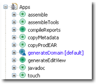

# Platform Tools

## Ant Utilities

### Contents
  * [Chapter 1: Architectural Overview](../README.md)
  * [Chapter 2: Concepts](./../chapters/concepts.md)
  * [Chapter 3: Identifying the Skyve Version](./../chapters/concepts.md)
  * [Chapter 4: Security, Persistence and Access control](./../chapters/security-persistence-and-access-control.md)
  * [Chapter 5: Exception Handling](./../chapters/exception-handling.md)
  * [Chapter 6: Customers](#customers)
  * [Chapter 7: Modules](#modules)
  * [Chapter 8: Documents](#documents)
  * [Chapter 9: Converters](#converters)
  * [Chapter 10: Bizlets](#bizlets)
  * [Chapter 11: Views](#views)
  * [Chapter 12: Actions](#actions)
  * [Chapter 13: Reports](#reports)
  * [Chapter 14: Jobs](#jobs)
  * [Chapter 15: Utility Classes](#utility-classes)
  * [Chapter 16: Common Patterns](#common-patterns)
  * [Chapter 17: Skyve Persistence Mechanisms](#skyve-persistence-mechanisms)
* [Section 4: Platform Tools](#platform-tools)
  * **[Chapter 18: Ant Utilities](#ant-utilities)**
    * [Generate Domain](#generate-domain)
    * [Generate a Default Edit View](#generate-a-default-edit-view)
    * [Generating a Deployable Archive - copyProdEAR](#generating-a-deployable-archive---copyprodear)
    * [Javadoc](#javadoc)

Specific to the Java implementation of Skyve, Skyve projects include a
build.xml file which contains a number of utilities to assist
developers. To access the utilities, drag the build.xml file into the
ant view in Eclipse.

_Figure 88 Accessing the ant utilities_

The default target is generateDomain – which performs model validation
and generates the domain classes.

_Figure 89 Ant tasks_

Developers can customise the build.xml, adding their own targets as
required, or customising those provided.

### Generate Domain

From the ant view, double-click the *generateDomain* target to validate
the application model and generate domain classes. The *generateDomain*
target parameter is the path to the src folder being validated (normally
“src/”).

### Generate a Default Edit View

To save time, it can be useful when creating a custom view to start with
the default view as Skyve would generate for a document on-the-fly.

From the ant view, edit the target and nominate the customer, module and
document arguments.

_Figure 90 Setting the parameters to create a default edit view_

When you run the target, a file generatedEdit.xml will be created at the
in the file system at the top level of the project.

_Figure 91 Locating the generated edit view_

### Generating a Deployable Archive - copyProdEAR

The copyProdEAR target copies all files required for deployment, without
the associated git or subversion files into a deployment ear folder in
the project prod folder.

_Figure 92 Creating a deployable archive_

### Javadoc

Skyve provides a javadoc ant target which generates a documentation set
incorporating:

-   doc metadata attributes as specified in the Skyve metadata,

-   generic javadoc, and

-   logical model graph, generated using graphviz “dot” application.

To ensure that graphviz can generate model graphs, ensure that
..\\Graphviz\\bin is in your environment path.

Custom javadoc can also be created using the usual doclet interface.

The javadoc utility includes a combination of the application metadata
formatted and combined with the embedded documentation.

_Figure 93 Example of formatted application specification combining
metadata and embedded documentation_

Skyve includes documentation attributes at every level of application
metadata.

Users can include basic html-style documentation within the metadata
"doc" attributes. The utility assembles this html and combines it with
self-describing metadata (like tool-tip definitions already embedded in
the metadata), according to the concepts inherent in the platform.

The utility creates a full documentation set including:

-   Titles,

-   Overviews,

-   Indexes and Table of Contents for each section,

-   Automatic numbered references for each section, table and figure,

-   Internal links, and

-   External links.

Because the utility generates documentation for every part of the
application specification, it encourages developers and technical
writers to be thorough and cover all aspects of the application they are
documenting.

_Figure 94 Customise the javadoc task to specify the package and
destination directory_

**[⬆ back to top](#contents)**

---
**Next [Chapter 19: Content Repository Tools](./../chapters/content-repository-tools.md)**  
**Previous [Chapter 17: Skyve Perstistence Mechanisms](./../skyve-persistence-mechanisms.md)**
