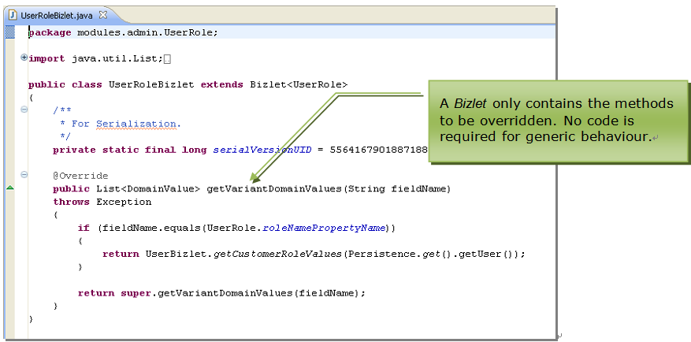

## Bizlets

### Contents

* [Chapter 1: Architectural Overview](../README.md)
* [Chapter 2: Concepts](./../chapters/concepts.md)
* [Chapter 3: Identifying the Skyve Version](./../chapters/concepts.md)
* [Chapter 4: Security, Persistence and Access control](./../chapters/security-persistence-and-access-control.md)
* [Chapter 5: Exception Handling](./../chapters/exception-handling.md)
* [Chapter 6: Customers](#customers)
* [Chapter 7: Modules](#modules)
* [Chapter 8: Documents](#documents)
* [Chapter 9: Converters](#converters)
* **[Chapter 10: Bizlets](#bizlets)**
  * [Lifecycle](#lifecycle)
    * [Bean level:](#bean-level)
    * [User Interface level:](#user-interface-level)
  * [Implicit Actions](#implicit-actions)

A *Bizlet* is a class related to a document which extends default bean
behaviours.

*Bizlets* can reference other classes without restriction and may be the
point of connection to highly specific application code.

The intention of the *Bizlet* is to contain only code relevant and
contextualised to a specific document, and so *Bizlet* classes are
located within the document package. Cross-document code or module-level
code should be included in a class created at the module level or
higher.

_Figure 48 - Bizlet file location within the document package_

Bizlet classes only contain the minimum required code and methods, e.g.
only the necessary overrides. No code is required (in fact no Bizlet
class is required) for generic or default behaviour.

A Bizlet class may override bean-lifecycle methods.

_Figure 49 - Example Bizlet method override_

### Lifecycle

Lifecycle event timing is as follows:

#### Bean level:

  Event | Description
  ----- | -----------
  newInstance() | called after instantiation through the *document.newInstance()*  The *newInstance()* method is commonly overridden to set application default values for the document.  If an exception occurs the bean will not be instantiated.
  postLoad() | called after instantiation and population of data store values  The *postLoad()* method can be called to recalculate values which are visible in a document list or detail view.  If an exception occurs, the associated view will open with an error dialog.
  preSave() | called before flushing the values to the data store or User press of \[Save\] button (before document validation)  The *preSave()* method can be overridden to ensure application rules or calculated fields are up to date before the bean is persisted.  If an exception occurs at this stage, the transaction will roll back and the change will not be saved.
  validate() | called after *preSave()* (and after document validation) but before flushing the values to the data store  The *validate()* method is commonly overridden to include additional complex document validation (other than implicit validation of requiredness etc.).  If an exception occurs at this stage, the transaction will roll back and changes will not be saved.
  postSave() | called after flushing values to the data store and after all integrity and validation checks have been performed  The *postSave()* method might be overridden to perform an action only on a successful save of the bean, e.g. to send a confirmation email.  If an exception occurs at this stage, the transaction will roll back and changes will not be saved.
  preDelete() | called before deletion from the data store  The *preDelete()* method might be overridden to perform a logical check that the record can be deleted, according to rules which can’t be enforced by a simple constraint.  If an exception occurs at this stage, the transaction will roll back and the data will not be deleted.

_Table 8 - Bean level events_

#### User Interface level:

  Event | Description
  ----- | -----------
  getConstantDomainValues(), getVariantDomainValues(), getDynamicDomainValues() | called when rendering the pertinent field (including in list view) depending on the domain type declared for the attribute
  preExecute() | called before an implicit action is executed

_Table 9 - User Interface level events_

### Implicit Actions

Skyve provides a number of implicit actions which do not require
developer code.

In each case overriding the *preExecute*() method for an
*ImplicitActionName* gives the developer the opportunity to add business
logic in anticipation of each action type.

Full details of implicit actions are provided later in Table 20.

**[⬆ back to top](#contents)**

---
**Next [Chapter 11: Views](./../chapters/views.md)**  
**Previous [Chapter 9: Converters](./../chapters/converters.md)**
