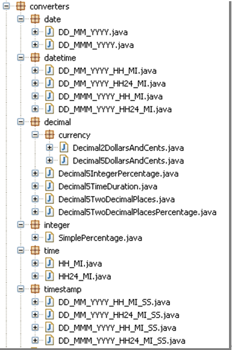
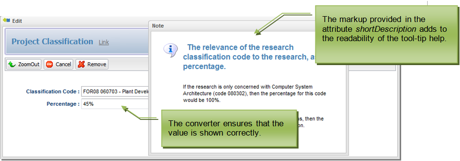

Converters {#converters-1 .ChapterHeading}
==========

In certain circumstances, data of the same type may need to be
represented in differing formats.

For example, 2-digit decimal numbers may need to be represented as
currency, percentages, time or as latitude-longitude.

A traditional approach might use a basic type and then specify a
particular format-specific widget or format converter in a view, or even
format the value to a String in code. The Skyve approach is to declare
that an attribute uses a converter so Skyve can enforce the format
conversion automatically and pervasively throughout the application.

### Defined Converters {#defined-converters .Sectionheading}

Skyve provides a number of generic type converters.

{width="2.3784722222222223in" height="3.60625in"}

Figure 40 Converters

Converters can be declared as default for a customer (within the
*customer.xml*), or for an attribute (within the *document.xml*).

{width="5.0152777777777775in"
height="1.4090277777777778in"}

Figure 41 Converters can be declared as default for a specific type, for
a customer

Converters declared as the default converter on a document attribute
will ensure that the value of the attribute is always represented
consistently throughout the application.

{width="5.0152777777777775in"
height="0.6819444444444445in"}

Figure 42 Document attribute may declare a converter

Converters should also be used within developer code to ensure a
consistent representation throughout the application.

{width="4.939583333333333in"
height="0.2881944444444444in"}

Figure 43 Example use of converter within Bizlet code

The converter will provide format hints to the user when fields are
empty.

{width="2.1215277777777777in" height="0.39375in"}

Figure 44 Format hints for data entry

Worked Example {#worked-example-1 .Chaptersubheading}
--------------

### Requirement {#requirement-1 .Sectionheading}

An application must display research classifications by code, with each
code attributed a percentage. The percentage must always be a whole
number with the % sign included.

### Implementation {#implementation-1 .Sectionheading}

To achieve this, an integer attribute *classPercentage* is declared as
follows:

{width="5.863888888888889in"
height="1.4694444444444446in"}

Figure 45 Worked converters example: attribute declaration

The attribute declares that the *SimplePercentage* converter applies to
the integer value of the *classPercentage* attribute. *SimplePercentage*
includes a % sign when the value is displayed, but ignores the % sign if
entered by the user.

The attribute *shortDescription* is added to provide expansive context
help.

The developer regenerates the domain (using the ant task) and redeploys
the application to the application server.

### Results {#results-1 .Sectionheading}

Skyve guarantees that the attribute will always have the conversion
applied.

In the edit view, the percentage value is displayed with the % sign. The
value stored is an integer whether the user enters the % sign or not.

{width="6.5152777777777775in"
height="2.3333333333333335in"}

Figure 46 Worked converters example: converted value as displayed in the
edit view, with tool-tip help

If the user enters the value without a % sign, the displayed value will
be updated to include the % sign when the widget loses focus.

The *classPercentage* attribute will be shown with the % sign in all
contexts (including in grids).

{width="4.802777777777778in"
height="1.1819444444444445in"}

Figure 47 Worked converters example: converted value as displayed in a
grid.
