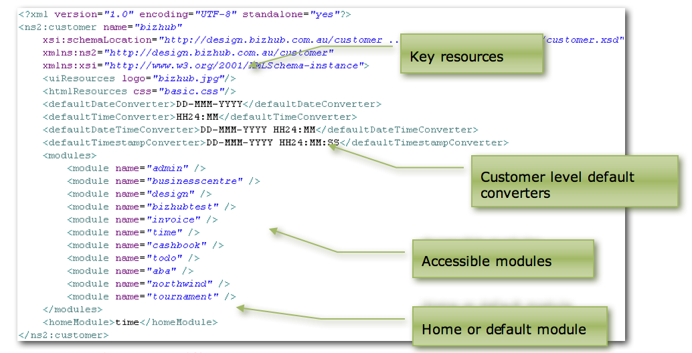

# Building Applications

## Customers

### Contents

* [Chapter 1: Architectural Overview](../README.md)
* [Chapter 2: Concepts](./../chapters/concepts.md)
* [Chapter 3: Identifying the Skyve Version](./../chapters/concepts.md)
* [Chapter 4: Security, Persistence and Access control](./../chapters/security-persistence-and-access-control.md)
* [Chapter 5: Exception Handling](./../chapters/exception-handling.md)
* **[Chapter 6: Customers](#customers)**
  * [Resources](#resources)
  * [Modules](#modules)

Skyve supports multi-tenant Software-As-A-Service (SAAS) applications
with extensive ability to customise the application for each
tenant/customer.

Each customer’s experience of the application is declared within the
customer package. The customer package includes a `customer.xml`
manifest file and a resources folder.

By convention, developers are encouraged to locate all
application-specific artefacts (such as project management and reference
materials) within the customer package.

_Figure 15 - Example customer package_

The `customer.xml` file declares which modules the customer has access
to, which default converters to use, the location of key resources, and
the default (or home) module.

_Figure 16 - Example customer.xml file_

The `customer.xml` file must declare the customer name. The customer
name is used to differentiate ownership of data rows within the database
(and therefore also users at the default login page).

The `customer.xml` file also declares the location of the customer logo
file (displayed in the top left hand corner of the UI above the
accordion pane), and assumes the file is located within the customer’s
resources folder.

### Resources

Skyve provides a resource hierarchy to allow for the inclusion of
additional resources in a generic way.

Throughout the application, resources (like the *relativeIconFileName*
for actions) resolve the applicable resource location from the resources
hierarchy.

Resources (e.g. button icon files) can be defined for each module within
the module *resources* folder. Resources can also be defined per
customer within the customer *resources* folder (e.g. the company logo
file).

A module *resources* folder can be overridden as part of a customer’s
module override by placing files of the same name as occur in the
original module.

So that report templates can references resources in a generic way, the
absolute file location of the customer resources folder is resolved at
run-time and included automatically as a report parameter.

### Modules

The `customer.xml` file lists all modules accessible to the customer.

The order of modules listed in the `customer.xml` file is the order that
module-level accordion menus appear in the accordion pane. Additionally,
the order of modules defines the compile order. If developers create
cross-module code, the compile order must be considered for that
customer.

The home or default module is declared here but can be overridden per
user from within the user functionality (within the admin module).

**[⬆ back to top](#contents)**

---
**Next Chapter 7: Modules**  
**Previous [Chapter 5: Exception Handling](./../chapters/exception-handling.md)**
