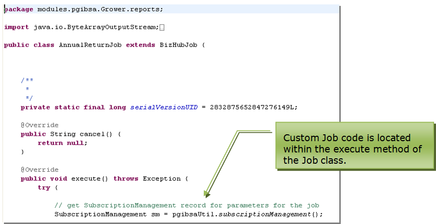

## Jobs

### Contents

* [Chapter 1: Architectural Overview](../README.md)
* [Chapter 2: Concepts](./../chapters/concepts.md)
* [Chapter 3: Identifying the Skyve Version](./../chapters/concepts.md)
* [Chapter 4: Security, Persistence and Access control](./../chapters/security-persistence-and-access-control.md)
* [Chapter 5: Exception Handling](./../chapters/exception-handling.md)
* [Chapter 6: Customers](./../chapters/customers.md)
* [Chapter 7: Modules](./../chapters/modules.md)
* [Chapter 8: Documents](./../chapters/documents.md)
* [Chapter 9: Converters](./../chapters/converters.md)
* [Chapter 10: Bizlets](./../chapters/bizlets.md)
* [Chapter 11: Views](./../chapters/views.md)
* [Chapter 12: Actions](./../chapters/actions.md)
* [Chapter 13: Reports](./../chapters/reports.md)
* **[Chapter 14: Jobs](#jobs)**
  * [Job Classes](#job-classes)

Skyve provides a mechanism for executing and scheduling offline Jobs
(i.e. Jobs processed irrespective of the state of the conversation or
session).

Jobs are declared in the *module.xml* file in the *jobs* section.


_Figure 71 - Example job declaration within the module.xml file_

Job declaration includes logical name, *displayName* and *className.*

The *className* nominates the specific class file to be executed.

Once jobs have been declared, they are available to be scheduled at
run-time via the *admin* module job scheduler function.

The *admin* module provides comprehensive job scheduling functionality,
including assignment of the user under whose privileges the Job will be
executed.

Scheduling Jobs from the *admin* module requires the *JobMaintainer*
role.

### Job Classes

Job classes must extend the `org.skyve.job.Job` abstract class. Custom job code is located in the `execute()` method.



_Figure 72 - Example Job class_

Jobs can be scheduled in action or *Bizlet* code using the
*JobScheduler* class.

```java
/**
 * Kick off the annual returns job
 */
@Override
public ServerSideActionResult<GrowerSearchCriteria> execute(GrowerSearchCriteria search, WebContext WebContext) throws Exception {
  User user = CORE.getPersistence().getUser();
  Customer customer = user.getCustomer();
  Module module = customer.getModule(Grower.MODULE_NAME);
  Job job = module.getJob("jAnnualReturns");

  EXT.runOneShotJob(job, search, user);

  search.setReturnResults("The generation job has commenced.");

  return new ServerSideActionResult<>(search);
}
```

_Figure 73 - Example action class code to run a one-shot Job_

As Jobs are run within the context of a user so that Skyve’s embedded
comprehensive security model can be enforced.

Developers must consider whether a user context will have sufficient
privileges for the Job to be executed.

**[⬆ back to top](#contents)**

---
**Next [Chapter 15: Utility Classes](./../chapters/utility-classes.md)**  
**Previous [Chapter 13: Reports](./../chapters/reports.md)**
