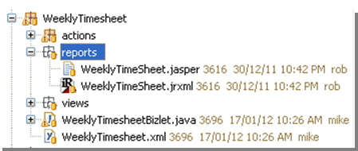
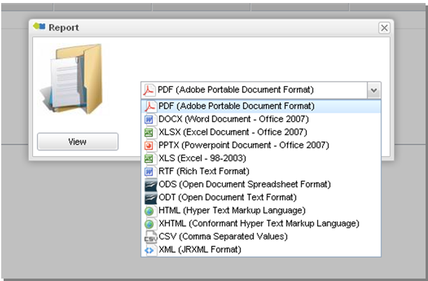

## Reports

### Contents

* **[Chapter 13: Reports](#reports)**
  * [Custom Reports](#custom-reports)
    * [Automatic Customer Resource Parameter](#automatic-customer-resource-parameter)
    * [Object data source](#object-data-source)
  * [Ad-hoc Reports](#ad-hoc-reports)
  * [Offline Reporting Jobs](#offline-reporting-jobs)

Skyve provides extensive ad-hoc reporting functions via the export
capabilities available within every *listGrid* and list view, however,
where highly formatted reports are required, these are provided via
Jasper Reports.

### Custom Reports

Jasper report templates, created using iReport, are located within the
reports folder of the driving document.

]

_Figure 67 Report objects are located within the reports folder for the
applicable document_

Report actions must be declared in a view for reports to be accessible
to the user. If no view has yet been defined, use the *generateEditView*
ant task to generate a default view definition and then add the required
report actions to the action section.

By default, report actions are displayed with the printer icon.

_Figure 68 Example report action button_

To ensure all reports are valid and can be run, use the *compileReports*
ant task to recompile all Jasper reports.

When reports are requested by the user (using the report action button)
Skyve will offer the user a choice of formats in which the report will
be rendered.

_Figure 69 Selecting a report format_

It is the responsibility of the report designer to consider the
implications of the user selecting a format which the designer has not
catered for.

#### Automatic Customer Resource Parameter

Skyve automatically passes a contextual parameter named *RESOURCE\_DIR*
containing the location of the customer resource folder to the reporting
engine, evaluated at run-time.

This parameter does not need to be declared within the report action
declaration however Skyve cannot enforce that these parameters are
declared within the report template. If developers wish to make use of
these report parameters they must ensure they are declared within the
report template.

The parameter *RESOURCE\_DIR* is evaluated at the time the report is
requested by the user (i.e. at run-time).

As this parameter points to the central repository for customer
resources, it is useful for logo files and other images and objects
which might be part of highly formatted reports. By passing the specific
customer resource location (evaluated at run-time) references to these
types of items can be used generically for all customers.

#### Object data source

Skyve provides an object data source which can be used in place of SQL
as the driving query for the report. The object data source provides the
state of the beans in memory, whereas SQL queries will only return
persisted (i.e. saved) values.

If the bean passed to the report has collections, these can be used as
the basis for grouped detail rows, as with SQL data sources.

_Figure 70 Example report query using the object data source declared in
iReport._

### Ad-hoc Reports

Ad-hoc reports, created by the user from the *listGrid* *export table
data* function tool, are created on-the-fly by Skyve.

The report title will be the query *displayName*. Ad-hoc report
definitions are generated in code and passed directly to the reporting
engine.

### Offline Reporting Jobs

Jobs can be declared to create reports offline, including bulk report
generation. Jobs are described in the next section.

**[⬆ back to top](#contents)**

---
**Next [Chapter 14: Jobs](./../chapters/jobs.md)**  
**Previous [Chapter 12: Actions](./../chapters/actions.md)**
