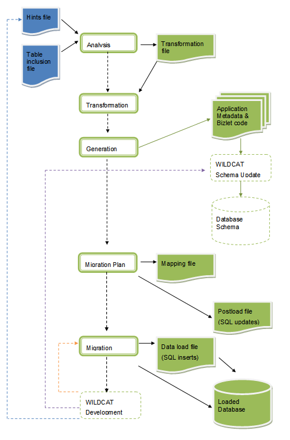

## WILDCAT Conversion Tool

### Contents

* **[Chapter 21: WILDCAT Conversion Tool](#wildcat-conversion-tool)**
  * [Using the Skyve Converstion Tool (WCT)](#using-the-skyve-converstion-tool-wct)
  * [Development Approach and Roundtripping](#development-approach-and-roundtripping)
  * [Report Conversion](#report-conversion)

NOTE: Refer to the WCT developer guide for full details.

### Using the Skyve Converstion Tool (WCT)

Application metadata may be created using WCT. WCT combines ETL
capabilities with generation of *Bizlet* code and application metadata.

Because WCT performs data migration, it is important that developers
working on a WCT solution approach application development with the
final data migration in mind.

WCT provides the capability for an iterative generate, transform,
migrate cycle.

WCT relies on Skyve to automatically manage database schema updates via
Hibernate and so does not create Data Definition Language (DDL) tasks or
create or manage database objects directly.

WCT creates a number of artefacts to allow developers to adjust the
process at each step.

The development method using WCT is as follows:

WCT process | Description | Artefacts
------------|-------------|----------
Analysis    | WCT performs analysis of the source database using the Table Inclusion file and Hints file. | Table Inclusion file   Hints file  
Transformation | WCT creates a default Transformation file | Transformation file
Generation | WCT generates application metadata and Bizlet code.   Skyve application metadata and Bizlet code | Skyve performs schema updates according to the application metadata, resulting in an updated destination DB schema.
Migration Plan | WCT creates a default migration plan (as a mapping file), which includes SQL update statements for references. A postload file is also created, containing just the SQL update statements.  SQL updates run after the data is migrated to the destination DB and use legacy fields as staging mechanisms.  The postload file can be used to ensure referential integrity after subsequent data manipulations during the development process. | Mapping file  Postload file
Migration | WCT either migrates the data directly from the source DB to the destination DB, or creates a data load file. | Data load file (optionally)

_Figure 96 Detailed Conversion Process and Artefacts_

### Development Approach and Roundtripping

Generally, a number of cycles are completed to establish an application
baseline.

From here, developers work directly with the application metadata,
rather than re-generating the data via WCT.

To ensure the integrity of the data migration process, if changes to the
metadata impact basic data model, developers:

-   update the WCT Hints file, recreate a transformation and mapping
    file ready for migration, and

-   hand-craft DDL and SQL updates if work will progress before another
    migration.

Generally, developers will also need to hand-craft a number of SQL
statements for data cleansing, modifying data values and for
manipulations of data not within the WCT migration scope. These SQL
statements should be maintained in a separate file to be run after the
migration step.

Deprecated legacy fields should not be removed from the model or
database until after the final data migration and go-live.

For example, a change to the nature of the relationship between two
objects originating from the source DB will require a modification to
the WCT Hints file so that data will be correctly loaded in subsequent
migrations.

A change to the nature of relationship between objects outside of the
scope of the originating DB requires no change to the WCT artefacts.
Data loading from legacy tuples to new tuples and data cleansing tasks
need to be recorded to be re-run after the final data migration and
go-live, but don’t impact WTC artefacts.

### Report Conversion

WCT includes capability for conversion of MS Access report templates to
iReport template files, including basic conversion of MS Access via
“query explosion”, where Access reports reference multi-level queries
(implemented as separate queries in MS Access), WCT recursively converts
SQL from MS Access to SQL in the selected destination dialect.

Report conversion is a separate process and can happen in parallel with
application development and Skyve round-tripping.
